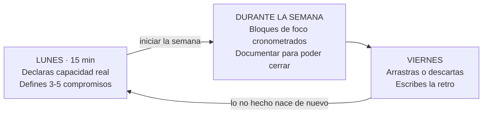

<div align="center">

# Ritmo

### El gestor de tareas que no te deja mentirte

**Ritmo no te ayuda a organizarte. Te obliga a rendir cuentas.**<br/>
No puedes cerrar una tarea sin documentarla. No puedes disfrazar una interrupción<br/>
de tarea planificada. No puedes borrar el arrastre reescribiendo la tarea.

<br/>

[](https://nextjs.org)
[](https://react.dev)
[](https://www.typescriptlang.org)
[](https://tailwindcss.com)

[](https://www.prisma.io)
[](https://www.postgresql.org)
[](https://zod.dev)
[](https://vercel.com)

<br/>


**[Empezar](#empezar-en-5-minutos)** · **[Cómo funciona](#el-ciclo-semanal)** · **[Las reglas](#las-cuatro-reglas-que-no-puedes-saltarte)** · **[Documentación](#documentación)**

</div>

---

## El problema

Un puesto cómodo, sin presión y sin nadie que pregunte *"¿documentaste?"* es una
trampa silenciosa. La disciplina se erosiona sin que nadie lo note — hasta que
tres meses después alguien pregunta por qué no hay documentación de nada, y ya es
tarde.

La mayoría de las apps de productividad empeoran ese problema: te dan la
sensación de control sin exigirte nada. Marcas una casilla y sigues igual.

## La diferencia

|  | Un gestor de tareas | **Ritmo** |
|---|---|---|
| Cerrar una tarea | Un clic | **Imposible sin documentación** |
| Trabajo imprevisto | Otra tarea más | **Etiquetado aparte, automáticamente** |
| Lo que no hiciste | Se arrastra en silencio | **Queda contado y apuntando al original** |
| Tu cumplimiento | No se mide | **Un porcentaje que no puedes discutir** |
| Un cero sin datos | Verde, enhorabuena | **Gris: ausencia de información no es logro** |

> Si una función te resulta incómoda, normalmente es porque está funcionando.

---

## El ciclo semanal



Al pulsar **iniciar la semana** ocurre lo importante: todo lo que entre a partir
de ese momento queda marcado como **no planificado**. Esa etiqueta no la eliges
tú — la decide el estado del ciclo. Una incidencia del miércoles no puede
disfrazarse de tarea prevista el lunes.

Al **cerrar el viernes**, lo que arrastras nace de nuevo en la semana siguiente
apuntando a la tarea que no se hizo. El arrastre no se borra reescribiendo la
tarea: ese es exactamente el punto.

---

## Las cuatro reglas que no puedes saltarte

**1. Una tarea no está hecha hasta que está documentada.**
Si el compromiso exige documentación y no hay ni notas ni un documento vinculado,
la app se niega a cerrarlo. No es un aviso: es un error. Y "Hecho" no aparece en
el desplegable de estados — solo se alcanza por el botón que valida.

**2. El calendario decide qué fue planificado, no tú.**
Mientras la semana está en planificación, lo que agregas cuenta como planificado.
En cuanto arranca, todo lo nuevo se marca como no planificado. Sin excepciones,
sin editarlo después.

**3. Lo abierto se arrastra o se descarta. No hay tercera opción.**
El viernes cada tarea sin cerrar exige una decisión. Dejarla flotando es lo que
hacías antes de tener la app.

**4. Un documento no puede dejar huérfano a un compromiso cerrado.**
Si es la única prueba de una tarea cerrada, no se puede desvincular ni borrar.
Sin esto, la regla 1 se vaciaría por la puerta de atrás.

---

## Las pantallas

<!--
  Para añadir capturas: guárdalas en docs/img/ y descomenta las líneas de imagen
  bajo cada pantalla. Recomendado: 1440px de ancho, tema oscuro y claro.
-->

<details open>
<summary><b>Hoy</b> — dónde se va realmente tu tiempo</summary>
<br/>

Bloques de foco con **cronómetro real**, contador de distracciones y cierre del
día.

- **Un solo bloque puede correr a la vez.** Dos cronómetros simultáneos son la
  dispersión que la herramienta combate.
- Las distracciones solo se cuentan **mientras el bloque corre**. Contarlas al
  final del día es inventarlas.
- Al terminar, la app no pregunta *"¿estuvo protegido?"* sino **cuántos minutos te
  robó una interrupción**. Lo primero invita a mentirse; lo segundo no tanto.
- El cierre del día pide energía, concentración y **un logro obligatorio**. Un día
  sin ningún logro registrado casi nunca es un día sin logros: es un día que no
  miraste.

</details>

<details>
<summary><b>Semana</b> — el auto-Scrum de quien trabaja solo</summary>
<br/>

Los dos rituales y todo lo que pasa entre ellos.

- **Lunes (15 min):** declaras tu capacidad *real* —descontando soporte,
  reuniones e interrupciones— y defines 3-5 compromisos concretos.
- **Durante:** registras el trabajo no planificado que entra, documentas y
  cierras, y anotas los **bloqueos** cuando ocurren, no el viernes de memoria.
- **Viernes:** la retro. Arrastras o descartas, escribes qué salió bien y qué hay
  que mejorar, y la semana se cierra en una sola transacción.
- **Informe semanal:** una página imprimible con lo que la semana puede demostrar
  —cumplimiento, planificado contra no planificado, tiempo real por categoría y
  bloqueos— y su descarga en `.md`. Es el dato con el que defiendes tu tiempo
  ante la empresa, y hasta ahora no salía de la app.

</details>

<details>
<summary><b>Proyectos</b> — lo que dura más de una semana</summary>
<br/>

El ciclo semanal contesta *"¿cumplí?"*. El proyecto contesta la otra pregunta:
**"¿cuánto tiempo real llevo metido en esto?"**.

- Compromisos y documentos pueden colgar de un proyecto. **Siempre opcional**:
  un soporte suelto no pertenece a ninguno, y forzarlo llenaría la lista de
  proyectos falsos.
- El tiempo sale de los **bloques de foco cerrados**, nunca de un contador que
  haya que mantener a mano.
- Un proyecto con trabajo cerrado **no se borra**: se archiva. Y si se borra uno
  sin historial, sus compromisos y documentos sobreviven sin proyecto — el
  trabajo que hiciste no dejó de existir.

</details>

<details>
<summary><b>Documentos</b> — para que tu trabajo exista fuera de tu cabeza</summary>
<br/>

Editor Markdown con vista previa, búsqueda por título, módulo, contenido o
etiquetas, y cinco tipos: Feature, Proceso, Incidente, Reporte y Decisión.

- **Relación N:M con los compromisos.** Un incidente genera varios documentos; un
  documento de proceso cubre varias tareas.
- **Exportación a `.md`**, un documento o todos. Tu documentación no puede quedar
  secuestrada dentro de un proyecto personal: si mañana abandonas Ritmo, tiene que
  sobrevivir en archivos.
- La exportación completa incluye **también las notas que aún no ascendiste** a
  documento. Si no, la promesa de "puede salir de la app" sería falsa.

</details>

<details>
<summary><b>Métricas</b> — doce semanas, sin adornos</summary>
<br/>

Racha, cumplimiento medio, trabajo no planificado y arrastre acumulado, más cinco
gráficos de tendencia y la distribución real de tu tiempo por categoría.

- **Cada gráfico trae su tabla.** Ningún valor queda accesible solo por el color.
- **Con menos de dos semanas no se dibuja nada.** Un gráfico de una barra no es
  una tendencia, es un número disfrazado.
- **La racha ignora la semana en curso**: todavía puede caerse.

</details>

---

## Las métricas que importan

| Métrica | Meta | Qué te dice |
|---|:---:|---|
| **Cumplimiento** — solo sobre lo planificado | ≥ 80% | Si la semana valió |
| **Trabajo no planificado** | conocerlo | Si el problema es tu disciplina o tu carga de soporte |
| **Arrastre** | ≤ 1/semana | Si te sobre-comprometes o simplemente no cumples |
| **Compromiso vs capacidad** | 70-90% | Que cumplir el 100% de casi nada no cuente como cumplir |
| **Deuda de documentación** | 0 | Por diseño debería ser imposible que no lo sea |

Las dos que de verdad deciden: **arrastre** te dice *cuál* de los dos problemas
tienes, y **trabajo no planificado** es el único dato con el que puedes defender
tu tiempo ante tu empresa.

---

## Empezar en 5 minutos

**Necesitas** una base de datos [Neon](https://neon.tech) (capa gratuita) y
Node.js. Desarrollado con Node.js 24 y npm 11.

**1. Clona e instala**

```bash
git clone https://github.com/<tu-usuario>/ritmo.git && cd ritmo && npm install
```

**2. Configura el entorno**

Crea un `.env` con estas variables:

| Variable | Qué es |
|---|---|
| `DATABASE_URL` | Cadena **pooled** de Neon (el host lleva `-pooler`) |
| `DIRECT_URL` | Cadena **directa** (el mismo host sin `-pooler`) |
| `AUTH_SECRET` | Secreto para firmar la sesión |
| `GOOGLE_CLIENT_ID` | Credencial OAuth de Google Cloud Console |
| `GOOGLE_CLIENT_SECRET` | La otra mitad de la credencial |
| `ALLOWED_EMAILS` | Correos que pueden entrar, separados por comas |
| `APP_URL` | URL pública, solo en producción (para el `redirect_uri`) |
| `APP_PASSWORD` | Contraseña de respaldo |
| `ALLOW_PASSWORD_LOGIN` | `1` fuerza la contraseña, `0` la apaga |

Mientras no configures Google, **la contraseña sigue funcionando sola**: un
despliegue sin credenciales no puede dejarte fuera de tu propia app.

> Usar la cadena *pooled* para migraciones es el error número uno al empezar con
> Neon. Por eso son dos variables distintas.

Genera el secreto con:

```bash
node -e "console.log(require('crypto').randomBytes(32).toString('hex'))"
```

**3. Crea las tablas**

```bash
npm run db:migrate
```

**4. Arranca**

```bash
npm run dev
```

Abre `http://localhost:3000` y entra con tu contraseña. El despliegue en Vercel
está paso a paso en **[docs/SETUP.md](docs/SETUP.md)**.

---

## Cómo está construido

| Capa | Tecnología |
|---|---|
| **Framework** | Next.js 16 · App Router · Server Actions · React 19 |
| **Lenguaje** | TypeScript en modo `strict` |
| **Interfaz** | Tailwind CSS v4 · shadcn/ui · Radix · Recharts · lucide |
| **Datos** | Prisma 7 · Neon (PostgreSQL 18) · Zod |
| **Auth** | Google OAuth (OIDC, sin librería) con lista blanca · cookie firmada con HMAC-SHA256, sin sesiones en base de datos |
| **Despliegue** | Vercel + Neon, ambos en capa gratuita |

La arquitectura es de cuatro capas y el flujo de escritura siempre es el mismo:
**formulario → Server Action → servicio → Prisma**. Las reglas de negocio viven
en `src/server` y cada una tiene **un único punto de entrada**, para que no se
puedan saltar desde otro sitio.

Diagrama ER, cardinalidades y decisiones de modelado en
**[docs/UML-ACHITEC-TEC.md](docs/UML-ACHITEC-TEC.md)**.

---

## Calidad

Ocho suites. Siete se ejecutan **contra PostgreSQL real** — siembran sus datos y
los borran al terminar. No hay mocks: lo que interesa comprobar son las reglas y
las transacciones.

```bash
npm run check:dod        # 17 · la regla de documentación y el ciclo semanal
npm run check:fase2      # 23 · bloques de foco, zona horaria, registro diario
npm run check:fase3      # 25 · documentos, vinculación N:M, exportación
npm run check:fase4      # 22 · métricas agregadas, racha, historial
npm run check:fase5      # 28 · retro, cierre transaccional, arrastre, bloqueos
npm run check:informe    # 32 · informe semanal y su markdown
npm run check:proyectos  # 27 · proyectos, agregados y borrado seguro
npm run check:auth       # 36 · sesión, lista blanca e id_token de Google
```

**210 comprobaciones en verde.** Cubren lo que más fácilmente miente en una app
así: que el trabajo no planificado no contamine el cumplimiento, que los bloques
de una semana no se cuelen en otra, que la racha se corte donde debe, y que no
exista ningún segundo camino hacia "Hecho".

<details>
<summary>Otros comandos</summary>
<br/>

| Comando | Qué hace |
|---|---|
| `npm run dev` | Servidor de desarrollo |
| `npm run build` | Compilación de producción |
| `npm run lint` | ESLint |
| `npm run typecheck` | Comprobación de tipos |
| `npm run db:migrate` | Crea y aplica una migración |
| `npm run db:deploy` | Aplica migraciones en producción |
| `npm run db:studio` | Prisma Studio |

</details>

---

## Documentación

| Documento | Contenido |
|---|---|
| **[Ejemplos de Uso](docs/Ejemplos%20de%20Uso.md)** | Qué hace y **por qué** cada función de cada pantalla |
| **[UML, arquitectura y tecnologías](docs/UML-ACHITEC-TEC.md)** | Diagrama ER, capas, versiones exactas |
| **[Plan](docs/PLAN.md)** | Las fases del proyecto y la fórmula de cada métrica |
| **[Diseño](docs/DESIGN.md)** | Tokens, tipografía y patrones de componente |
| **[Setup](docs/SETUP.md)** | Puesta en marcha y despliegue |

---

## Antes de que lo instales

Conviene ser honesto sobre qué es esto:

- **Es una herramienta de un solo usuario.** No hay registro, ni equipos, ni
  roles: una contraseña y tú. Está pensada para autoalojarse.
- **Está en español**, y su tono es deliberadamente severo. No celebra, no
  gamifica, no te felicita por un cero.
- **Nació de un caso real**: alguien dando soporte de un ERP, desarrollando una
  app interna en solitario y haciendo de Product Owner, Scrum Master y equipo a la
  vez. Si te reconoces, encajará. Si trabajas en un equipo con procesos, no.

---

<div align="center">

### Una advertencia que forma parte del proyecto

Construir una app de productividad es la forma más elegante de procrastinar.<br/>
Por eso la primera versión ya era usable en una semana.

**La herramienta refuerza el hábito; no lo crea.**<br/>
Si la semana no se cierra el viernes con su retro,<br/>
esto es un proyecto bonito en lugar de una herramienta.

</div>
