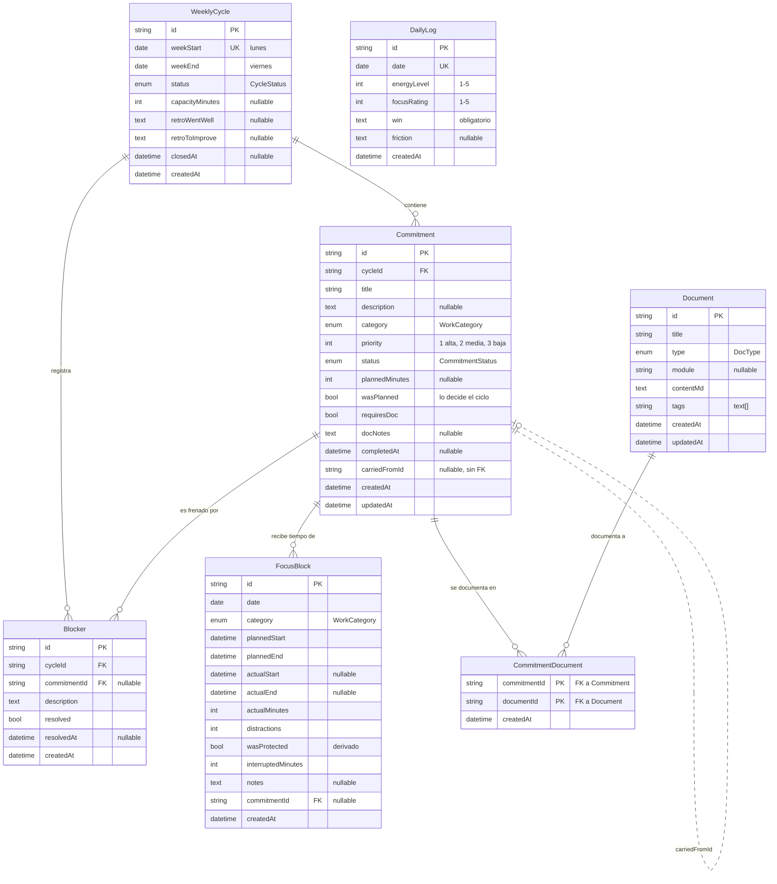

# Ritmo — Modelo de datos, arquitectura y tecnologías

Documento técnico del proyecto. Tres partes: el **UML de la base de datos**, la
**arquitectura** de la aplicación y las **tecnologías** utilizadas con su versión
exacta y el motivo de cada elección.

---

# 1. UML de la base de datos

Motor: **PostgreSQL 18.6** (Neon). Esquema gestionado con Prisma Migrate;
la definición vive en [`prisma/schema.prisma`](../prisma/schema.prisma) y la
migración inicial en `prisma/migrations/20260820151639_init/`.

## 1.1 Diagrama entidad-relación



`DailyLog` aparece sin relaciones **a propósito**: es un registro por día, no por
ciclo. Se cruza con las semanas por fecha, no por clave foránea, para que
sobreviva aunque un ciclo se borre.

## 1.2 Cardinalidades y borrado

| Relación | Cardinalidad | Al borrar el padre |
|---|---|---|
| `WeeklyCycle` → `Commitment` | 1 : N | `Cascade` — la semana se lleva sus compromisos |
| `WeeklyCycle` → `Blocker` | 1 : N | `Cascade` |
| `Commitment` → `FocusBlock` | 1 : N | `SetNull` — el bloque sobrevive: el tiempo se trabajó |
| `Commitment` → `Blocker` | 1 : N (opcional) | `SetNull` |
| `Commitment` ↔ `Document` | **N : M** vía `CommitmentDocument` | `Cascade` en ambos lados de la tabla puente |
| `Commitment` → `Commitment` | 0..1 (`carriedFromId`) | Sin FK: es una referencia histórica |

**Por qué `FocusBlock` usa `SetNull` y no `Cascade`:** si borras un compromiso, el
tiempo que dedicaste no dejó de existir. El bloque queda sin vincular pero sigue
contando en el total del día y en la distribución por categoría.

**Por qué `carriedFromId` no es una clave foránea:** es un rastro de auditoría
hacia una tarea que puede pertenecer a una semana ya eliminada. Una FK obligaría
a elegir entre cascada (perder el rastro) o bloqueo (impedir limpiezas). Se
resuelve como referencia suelta.

## 1.3 Enumeraciones

| Enum | Valores | Notas |
|---|---|---|
| `CycleStatus` | `PLANNING`, `ACTIVE`, `CLOSED` | `ACTIVE` solo se alcanza iniciando la semana; `CLOSED` solo por la retro |
| `CommitmentStatus` | `PLANNED`, `IN_PROGRESS`, `BLOCKED`, `DONE`, `CARRIED_OVER`, `DROPPED` | **`DONE` es inalcanzable manualmente** (ver 2.4) |
| `WorkCategory` | `SOPORTE`, `DESARROLLO`, `REPORTES`, `DOCUMENTACION`, `APRENDIZAJE`, `REUNION` | Modela el puesto real: soporte de ERP, app interna, reportes |
| `DocType` | `FEATURE`, `PROCESO`, `INCIDENTE`, `REPORTE`, `DECISION` | |

## 1.4 Índices y restricciones

| Tabla | Restricción / índice | Para qué |
|---|---|---|
| `WeeklyCycle` | `@@unique([weekStart])` | Garantiza **un solo ciclo por semana**; es lo que hace idempotente la creación automática |
| `WeeklyCycle` | `@@index([status])` | Filtrar ciclos cerrados en el historial |
| `Commitment` | `@@index([cycleId, status])` | Listado de la semana agrupado por estado |
| `Commitment` | `@@index([cycleId, wasPlanned])` | Cálculo del cumplimiento y del trabajo no planificado |
| `FocusBlock` | `@@index([date])`, `@@index([commitmentId])` | Bloques del día; suma de minutos por compromiso |
| `Document` | `@@index([type])` | Filtro por tipo en `/docs` |
| `CommitmentDocument` | `@@id([commitmentId, documentId])` | Clave primaria compuesta: impide vincular dos veces el mismo par |
| `Blocker` | `@@index([cycleId, resolved])` | Sin resolver primero |
| `DailyLog` | `date @unique` | **Un registro por día**: se corrige, no se duplica |

## 1.5 Decisiones de modelado que conviene conocer

**Fechas.** Los días usan `@db.Date` y se guardan como medianoche **UTC**; los
instantes usan `DateTime`. Todo se normaliza a `America/Lima` **en el servidor**
(`src/lib/dates.ts`), nunca en el cliente. Sin esto, en un servidor UTC como el de
Vercel un bloque de las 14:30 se guardaría como 14:30 UTC —09:30 en Lima— y las
columnas de fecha caerían un día antes.

**No hay tabla de usuarios.** Es una herramienta personal con una contraseña
única. Añadir `User` y `userId` habría sido complejidad sin caso de uso.

**No existe `Commitment.actualMinutes`.** El tiempo real **se deriva** sumando los
`FocusBlock` vinculados. Una columna contadora que se actualiza a mano desde
varios sitios se desincroniza siempre.

**`wasProtected` es un campo derivado**, no una respuesta del usuario: vale `true`
cuando `interruptedMinutes` es 0.

---

# 2. Arquitectura

## 2.1 Vista general

```
Navegador
   │  HTTPS
   ▼
┌─────────────────────────────────────────────┐
│  Next.js 16 · App Router                    │
│                                             │
│  src/proxy.ts ── puerta de autenticación    │
│        │  (runtime Node.js, HMAC)           │
│        ▼                                    │
│  Páginas RSC ──► Componentes cliente        │
│        │              │                     │
│        │              ▼                     │
│        │        Server Actions              │
│        ▼         (src/actions)              │
│  ┌──────────────────────────────────┐       │
│  │  Capa de servicio (src/server)   │       │
│  │  reglas de negocio + validación  │       │
│  └──────────────┬───────────────────┘       │
│                 ▼                           │
│         Prisma Client 7                     │
│      + @prisma/adapter-neon                 │
└─────────────────┬───────────────────────────┘
                  │  driver serverless
                  ▼
          Neon · PostgreSQL 18.6
```

## 2.2 Estructura de carpetas

```
prisma/          schema.prisma y migraciones
scripts/         suites de verificación (check-dod, check-fase2…5)
src/
  app/
    (app)/       rutas autenticadas, con navegación común
      hoy/       bloques de foco y registro diario
      semana/    ciclo, planificar, retro, historial
      docs/      listado, nuevo, detalle
      metricas/  tendencias
    api/         health y exportación a markdown
    login/       acceso por contraseña
    layout.tsx   raíz: fuentes, tema, idioma
    page.tsx     redirige a /semana
  actions/       Server Actions ("use server")
  server/        capa de servicio: reglas de negocio
  components/    UI: propias + shadcn/ui en components/ui
  lib/           auth, fechas, errores, etiquetas, cliente Prisma
  generated/     Prisma Client generado (no versionado)
  proxy.ts       puerta de autenticación
```

## 2.3 Las cuatro capas y su responsabilidad

| Capa | Dónde | Qué puede hacer | Qué no |
|---|---|---|---|
| **Presentación** | `src/app`, `src/components` | Renderizar, recoger formularios, mostrar errores | Contener reglas de negocio |
| **Acciones** | `src/actions` | Parsear `FormData`, validar con Zod, llamar al servicio, revalidar rutas | Hablar con Prisma directamente |
| **Servicio** | `src/server` | Reglas de negocio, transacciones, consultas | Conocer React o `FormData` |
| **Datos** | Prisma + Neon | Persistencia, integridad referencial | — |

El flujo de escritura siempre es el mismo: **formulario → Server Action → servicio
→ Prisma**. Las acciones capturan solo `ValidationError` (errores esperados,
mostrables al usuario); cualquier otro error se vuelve a lanzar, porque es un bug
y debe fallar ruidosamente. Ese contrato vive en `src/lib/errors.ts`.

## 2.4 Reglas de negocio con un único punto de entrada

Tres reglas se aplican en **una sola función** cada una, para que no puedan
saltarse desde otro sitio:

| Regla | Función | Salvaguarda |
|---|---|---|
| No se cierra una tarea sin documentar | `completeCommitment()` en `src/server/commitments.ts` | `changeStatus()` **rechaza explícitamente** `DONE`. Si aparece un segundo camino, falla en vez de vaciar la regla en silencio |
| Un ciclo solo se cierra por la retro | `closeCycle()` en `src/server/retro.ts` | Todo en una transacción: retro, arrastre, descarte y creación de la semana siguiente |
| Un documento no deja huérfano a un cerrado | `deleteDocument()` / `unlinkDocument()` en `src/server/documents.ts` | Impide vaciar la regla del DoD borrando la prueba a posteriori |

## 2.5 Autenticación

`src/proxy.ts` (en Next.js 16 el antiguo `middleware.ts`) intercepta toda petición
que no sea `/login` ni un recurso estático y exige una cookie de sesión válida.

La cookie es `expiraEnMs.HMAC-SHA256(expiraEnMs, AUTH_SECRET)`. **No hay sesiones
en base de datos**: el token se valida criptográficamente. Las comparaciones de
contraseña y de firma son de tiempo constante, y la cookie es `httpOnly`,
`sameSite=lax` y `secure` en producción.

Detalle relevante: `proxy.ts` corre en **runtime Node.js**, no en edge — por eso
puede usar `node:crypto` para verificar la firma. Con el antiguo middleware edge
esto no habría sido posible.

## 2.6 Renderizado y estado

- **React Server Components** por defecto; `"use client"` solo donde hay
  interacción real (formularios, cronómetro, gráficos).
- **Sin estado global**: no hay Redux ni Zustand. El estado del servidor son los
  datos; el del cliente se limita a `useActionState` y algún `useState` local.
- Las páginas con datos usan `export const dynamic = "force-dynamic"`: son de un
  solo usuario y el dato tiene que estar fresco.
- Tras cada mutación, `revalidatePath()` refresca las rutas afectadas.

## 2.7 Conexiones a la base de datos

Dos cadenas distintas, y confundirlas es el error más común con Neon:

| Variable | Cadena | Quién la usa |
|---|---|---|
| `DATABASE_URL` | **pooled** (host con `-pooler`) | El adaptador de Neon en tiempo de ejecución (`src/lib/prisma.ts`) |
| `DIRECT_URL` | **directa** (sin `-pooler`) | El CLI de Prisma para migraciones (`prisma.config.ts`) |

En Prisma 7 el bloque `datasource` del schema **ya no lleva `url` ni `directUrl`**:
la conexión de ejecución la aporta el driver adapter y la de migraciones se
declara en `prisma.config.ts`.

## 2.8 Verificación

Cinco suites ejecutan contra la base real, siembran sus datos y los borran al
terminar. **115 comprobaciones** en total:

| Comando | Comprobaciones | Cubre |
|---|---|---|
| `npm run check:dod` | 17 | La regla del DoD y el ciclo semanal |
| `npm run check:fase2` | 23 | Bloques de foco, zona horaria, registro diario |
| `npm run check:fase3` | 25 | Documentos, vinculación N:M, exportación |
| `npm run check:fase4` | 22 | Agregados, racha, distribución por categoría |
| `npm run check:fase5` | 28 | Retro, cierre transaccional, arrastre, bloqueos |

No son tests unitarios con mocks: golpean Postgres de verdad, porque lo que
interesa comprobar son las reglas y las transacciones, no las funciones aisladas.

---

# 3. Tecnologías

Versiones exactas instaladas, no aproximadas.

## 3.1 Entorno

| Herramienta | Versión |
|---|---|
| Node.js | 24.11.1 |
| npm | 11.5.2 |
| PostgreSQL (Neon) | 18.6 |

## 3.2 Núcleo

| Tecnología | Versión | Por qué |
|---|---|---|
| **Next.js** | 16.3.1 | App Router y Server Actions: mutaciones tipadas de extremo a extremo, sin escribir una API REST para un solo usuario |
| **React** | 19.2.8 | Server Components y `useActionState` |
| **TypeScript** | 5.x, modo `strict` | Los errores de dominio se detectan al compilar |
| **Turbopack** | incluido en Next 16 | Bundler por defecto |

## 3.3 Datos

| Tecnología | Versión | Por qué |
|---|---|---|
| **Prisma ORM** | 7.9.1 | Schema declarativo, migraciones versionadas y tipos generados desde el modelo |
| **@prisma/adapter-neon** | 7.9.1 | Prisma 7 **exige** un driver adapter; este habla el protocolo serverless de Neon |
| **Neon** | — | Postgres serverless con capa gratuita y separación pooled/directa |
| **Zod** | 4.4.3 | Validación en el borde del servidor, con los mensajes que ve el usuario |

## 3.4 Interfaz

| Tecnología | Versión | Por qué |
|---|---|---|
| **Tailwind CSS** | 4.x | Configuración por CSS; los tokens del sistema de diseño viven en `globals.css` |
| **shadcn/ui** | CLI 4.18.0 | Componentes copiados al repo, no una dependencia: se pueden editar |
| **Radix UI** | 1.6.7 | Primitivas accesibles bajo shadcn |
| **lucide-react** | 1.33.0 | Iconografía |
| **Recharts** | 3.10.1 | Gráficos; declara compatibilidad con React 19 |
| **react-markdown** | 10.1.0 | Render de documentación. **No interpreta HTML embebido**, así que el contenido no puede inyectar marcado |
| **remark-gfm** | 4.0.1 | Tablas y listas de tareas en Markdown |
| **date-fns / date-fns-tz** | 4.4.0 / 3.2.0 | Zona horaria fija `America/Lima` |
| **class-variance-authority**, **clsx**, **tailwind-merge**, **tw-animate-css** | — | Utilidades que arrastra shadcn/ui |

## 3.5 Desarrollo

| Herramienta | Versión | Uso |
|---|---|---|
| **ESLint** + eslint-config-next | 9.x / 16.3.1 | Linting |
| **tsx** | 4.23.12 | Ejecuta las suites `.mts` |
| **dotenv** | 17.4.2 | Carga `.env` fuera de Next |

## 3.6 Despliegue

| Pieza | Detalle |
|---|---|
| **Vercel** | Capa gratuita. Requiere `DATABASE_URL`, `DIRECT_URL`, `APP_PASSWORD` y `AUTH_SECRET` |
| **Neon** | Capa gratuita |
| **Migraciones** | `npm run db:deploy` (`prisma migrate deploy`) |

## 3.7 Deuda técnica conocida

`npm audit` reporta 3 vulnerabilidades *high* en `deepmerge-ts`, una dependencia
transitiva **del CLI de Prisma**. Es una `devDependency`: no entra en el bundle de
producción. La única corrección que ofrece npm es bajar a Prisma 6, peor remedio
que la enfermedad. Se revisará cuando Prisma actualice la dependencia.

---

## Documentos relacionados

- [`PLAN.md`](PLAN.md) — el plan por fases y las métricas con su fórmula
- [`DESIGN.md`](DESIGN.md) — el sistema de diseño
- [`SETUP.md`](SETUP.md) — puesta en marcha y despliegue
- [`Ejemplos de Uso.md`](Ejemplos%20de%20Uso.md) — qué hace y por qué cada función
